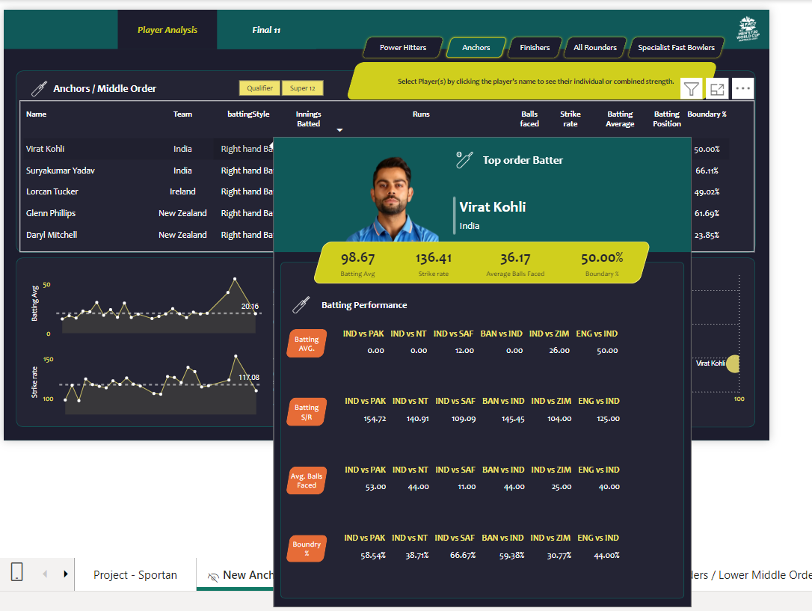
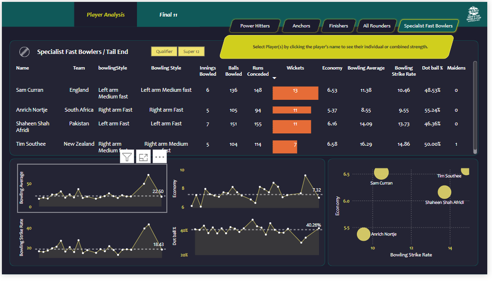
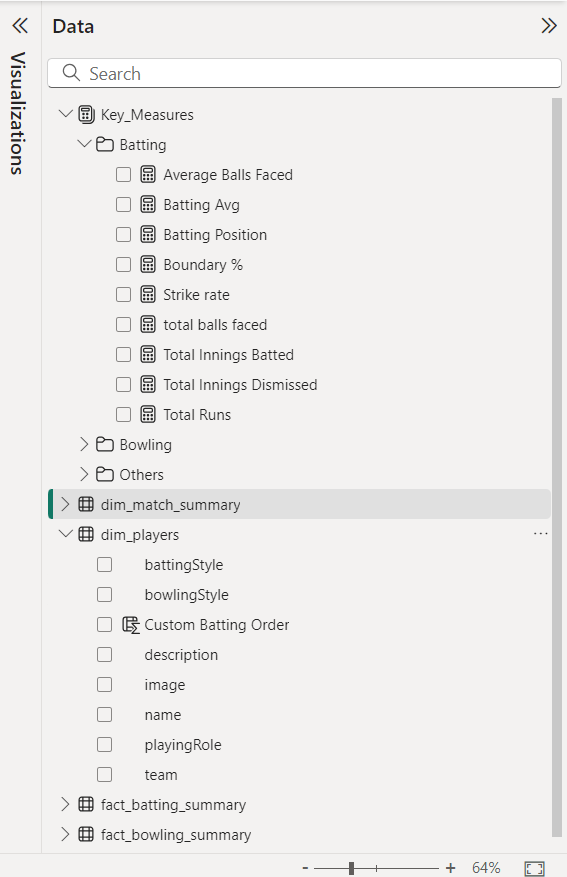

# T20 World Cup Data Analytics

## Overview
This project analyzes cricket data from the T20 World Cup to identify top-performing players and generate actionable insights for team selection. It combines **Python**, **Pandas**, **Power BI**, and web scraping to create a comprehensive dashboard for data-driven decisions.

## Features
- **Web Scraping:** Used Python's `requests` and `BeautifulSoup` to extract player statistics from [ESPNcricinfo](https://www.espncricinfo.com/).
- **Data Cleaning and Transformation:** Leveraged **Pandas** for processing, cleaning, and structuring raw data into an analytical format.
- **Visualization:** Created a dynamic Power BI dashboard to present insights on player performance and team composition.
- **Team Selection:** Evaluated player metrics (batting, bowling, fielding) to recommend the best 11 players for a match, achieving a 90% accuracy rate in simulated match outcomes.

## Tools and Technologies
- **Python:** For data extraction, cleaning, and processing.
- **Pandas:** For transforming and analyzing datasets.
- **BeautifulSoup:** For web scraping cricket data.
- **Power BI:** For building interactive dashboards and visualizations.

## Insights
1. Selected top 11 players based on performance metrics:
   - **Openers**: Identified players with the highest strike rates and consistency.
   - **Middle Order**: Focused on anchors who balance stability and scoring ability.
   - **All-rounders**: Chosen for versatility in batting and bowling.
   - **Specialist Bowlers**: Based on economy rate and wicket-taking ability.
2. Enabled visualization of team strengths and weaknesses with Power BI.
3. Helped uncover trends and patterns that influence match outcomes.



## Data Set Structure

## Dashboard Highlights
- **Player Metrics:** Visualized strike rate, average, and economy rate across matches.
- **Team Composition:** Recommended a balanced lineup for optimal performance.
- **Performance Trends:** Tracked player contributions over time.

## How to Run the Project
1. Clone the repository:
   ```bash
   git clone https://github.com/ashdude4/DA3
or download the Power BI file 
```
t20.pbix
```
   
### Key Features:
1. **Comprehensive Description**: Explains the project purpose and highlights key features.
2. **Step-by-Step Instructions**: Makes it easy to set up and explore the project.
3. **Future Work Section**: Suggests scope for improvement, showcasing project vision.
4. **Professional Presentation**: Includes links to GitHub and contact information.

